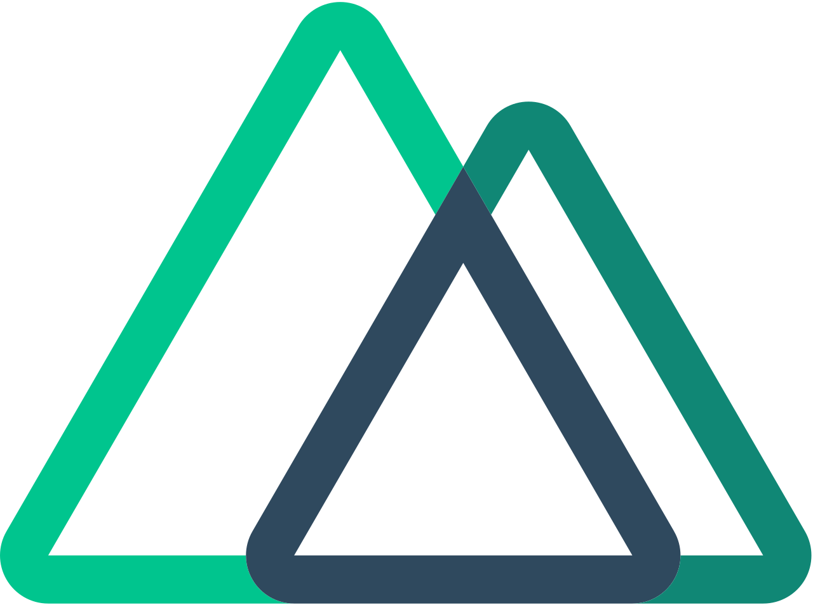

 

## I'm a Father, fresh in love, Developer, and Teacher!!

- 🌱 I’m currently learning everything 🤣
- 🥅 2022 Goals: Learn more about Discordeno
- ⚡ Fun fact: I love to play piano
- :heart: I love my kids
- :heart: Today engaged 24.02.2022 💑 Wedding date 23.03.2023 💒💍with <a href="https://discordapp.com/users/856520972152471582">☀𝕁𝕦𝕤𝕥 𝕒 𝕝𝕒𝕕𝕪𝕪🤍𝓐𝓴𝓪𝓼𝓱𝓪🌹#8950</a>

**Support:**

[][discord]

**Tutorials**

[][yt]

**Languages and Tools:**

<code></code>
<code></code>
<code></code>
<code></code>
<code></code>
<code></code>
<code></code>

| </a> |  |
| --------------------------------------------------------------------------------------------------------------------------------------------------------------------------------------------------------------------------------------------------------- | -------------------------------------------------------------------------------------------------------------------------------------------------------------------------------------------------------------- |

 

**Connect with me:**

<code></code>
&nbsp;&nbsp;
<code></code>
&nbsp;&nbsp;
<code></code>
&nbsp;&nbsp;
<code></code>

[discord]: https://discord.gg/9yUjFtcFqP
[yt]: https://www.youtube.com/channel/UCYWbRfaKuxioM9CV7oY0UNA
